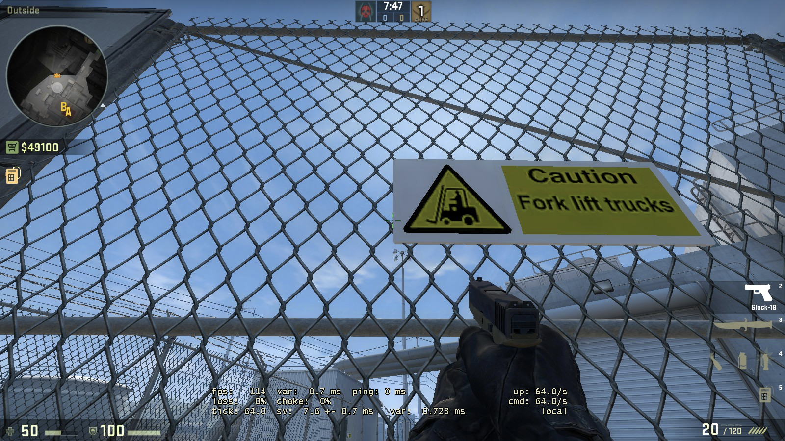

# de_nuke

toc::[]

# Terrorists

## Bomb A

### Molotov on Container roof

#### Jump on the left pillar outside of A (roof). Crouch until you are over the left rear corner, like shown in the Picture
image::images/de_nuke-51863.png[]

#### AIM at the middle of the second visible window on the right side

#### Aim at the roof top

#### Do a simple throw. If done right it should bounce into A and set the containers roof on fire

### Flash from Outside into Bomb A

#### Jump on the left pillar outside of A (root). Position in the middle back, like shown on the picture.

#### Aim at the edge of the glass roof thing at the right side where it meets with the smaller glass roof thing

#### Do a normal throw. If done right it bounces through the roof and blins Bomb A

### Flash into Bomb A

#### Position yourself in the room at the left corner of the visible rectancle on the ground

#### Aim at the corner (top quarter) like shown

#### Run forward and throw. If done right it bounces out of the container into Bomb A

## Bomb B

### Smoke B ramps

#### Run into corridor to B ramps. Position yourself in the corner at the door on the right.

#### Aim at the window like shown. Run throw.

#### If done right the smoke should smoke off B ramps.

## Outside

### Smoke off garage Sniper

#### Position yourself outside at the small sign on the fence.

#### Aim at the right side of the building and height of the second cable, like shown.

#### Run throw the smoke. If done right it smokes off any sniper in garage.

